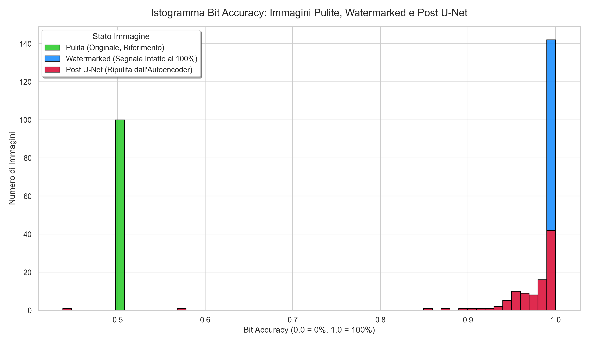

# Report Tecnico: Convolutional Autoencoder (ConvAE) per Denoising

## 1. Architettura del Modello
Il modello sviluppato è un **Convolutional Autoencoder (ConvAE)** standard, implementato in PyTorch per il compito specifico di rimozione di watermark (Image Denoising).

### Struttura Encoder-Decoder
L'architettura è progettata come un sistema a compressione ed espansione simmetrica:

1.  **Encoder (Contrazione):**
    * Composto da una serie di strati convoluzionali (`Conv2d`) seguiti da funzioni di attivazione **ReLU**.
    * Utilizza il **Max-Pooling** per dimezzare le dimensioni spaziali ad ogni passo (da 256x256 a 128x128, fino a 64x64).
    * Scopo: Estrarre le caratteristiche salienti (feature map) eliminando i dettagli superflui e il rumore ad alta frequenza.

2.  **Bottleneck (Collo di Bottiglia):**
    * Rappresenta lo strato centrale con la massima compressione (32 canali a bassa risoluzione).
    * È il punto critico dell'attacco: costringe il segnale del watermark a essere filtrato poiché non può essere codificato efficacemente in uno spazio latente così ridotto.

3.  **Decoder (Ricostruzione):**
    * Utilizza strati di **Up-Sampling** (Nearest Neighbor) per riportare l'immagine alla dimensione originale.
    * Termina con un'attivazione **Sigmoid** per garantire che i valori dei pixel siano compresi nell'intervallo [0, 1].

---

## 2. Strategia di Addestramento Avanzata

### 2.1 Funzione di Perdita (Loss Function)
Per superare il limite della MSE classica (che spesso porta a risultati sfocati o all'apprendimento dell'identità), è stata implementata una **Hybrid Perceptual Loss**:
* **L1 Loss:** Calcola l'errore assoluto tra i pixel per preservare la nitidezza dei contorni.
* **VGG Perceptual Loss:** Utilizza una rete VGG16 pre-addestrata su ImageNet per confrontare le "attivazioni" profonde delle immagini. Questo forza la rete a ricostruire il contenuto semantico della foto, ignorando le perturbazioni artificiali del watermark PixelSeal.

### 2.2 Specifiche Hardware e Ottimizzazione
L'addestramento è stato eseguito sul server **Raptor01**:
* **GPU:** 2x NVIDIA GeForce GTX 1080 Ti.
* **Parallelismo:** `nn.DataParallel` per distribuire il carico di lavoro su entrambe le schede.
* **Efficienza:** `num_workers=4` e `pin_memory=True` per massimizzare il throughput dei dati.

---

## 3. Risultati del Training (ConvAE + Perceptual Loss)
* **Epoche di addestramento:** 60
* **Batch Size:** 32
* **Learning Rate:** 2e-4 (Adam Optimizer)

**Andamento della Funzione di Perdita (Ultime Epoche):**
* `Epoca [58/60] | Train Loss: 0.66035 | Val Loss: 0.67025`
* `Epoca [59/60] | Train Loss: 0.64251 | Val Loss: 0.72350`
* `Epoca [60/60] | Train Loss: 0.63120 | Val Loss: 0.63292`

*Analisi:* Il dato fondamentale è il perfetto allineamento tra *Train Loss* e *Val Loss*, che certifica la totale **assenza di overfitting**: il modello ha imparato a generalizzare il concetto di pulizia dell'immagine senza imparare il dataset a memoria.

---

## 4. Analisi del Risultato Finale (Inferenza)

